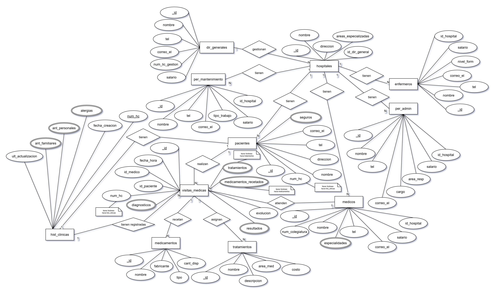

# Base de Datos (DB) SISTEMA HOSPITALARIO

###### Proyecto MongoDB: (Dante Salamanca Galvis & Nicolás Chedraui Mantilla)

 
 

### Introducción

A continuación se documenta minuciosamente el proceso que se siguió para ejecutar la elaboración de la base de datos solicitada para un sistema hospitalario enfocado en Bucaramanga y la zona metropolitana de Bucaramanga, implementando modelo conceptual, lógico y finalmente físico (otorgándole especial énfasis al proceso de normalización hasta la 3ra Forma Normal que se debe llevar a cabo entre estas últimas dos fases).

Se documenta cada parte del proceso, describiendo el flujo de trabajo lógico que se desarrolló, así como diagramas que muestran detalladamente los avances realizados en cada etapa del desarrollo de la BBDD, las entidades que derivaron de los requerimientos solicitados por el cliente y las relaciones entre estas (definiendo concretamente las cardinalidades que moldean estas relaciones: 1:1 / 1:N / N:M).

Finalmente, se realizan inserciones de datos dentro de nuestro sistema, se crean usuarios con diferentes permisos de acceso a la base de datos; ejecutando pruebas, como última medida, a través de consultas y funciones dentro de la BBDD que permitan a quienes tengan acceso a ella el poder manipular la forma en la que la información se presenta, pudiendo realizar diferentes tipos de filtrado de datos, entre otros tipos de consultas.

 
 

### Caso de Estudio

El caso de estudio que dio origen a esta base de datos se centró, como se mencionó anteriormente, en el desarrollo de un modelo de datos para un sistema de aplicaciones de bases de datos para un sistema hospitalario o de salud alojado en la zona metropolitana de Bucaramanga, Colombia.

La tienda solicitaba una base de datos robusta que permitiera almacenar distintos tipos de información relacionada con las áreas que el sistema de salud deseaba cubrir. El cliente requería no sólo un sistema que almacenara datos sobre los pacientes, tratamientos, médicos, hospitales o administradores encargados de gestionar parte importante de cada hospital, sino también una estructura específica para el modelo de datos.

Por un lado, se necesitaba que los empleados de cada hospital estuvieran diferenciados en cinco tipos o roles: directores generales (bajo el cargo de estos se hallan uno o más hospitales por director; pero hay que tener en cuenta que cada hospital sólo podía ser asignado a un único dirigente), médicos, personal administrativo, personal de mantenimiento y enfermeros.

Algunas de las posibles entidades que surgieron a partir de los requerimientos ya poseían una estructura determinada por el cliente, o simplemente una base o esquema inicial sobre el cuál se podían empezar a realizar múltiples cambios a conveniencia del mantenimiento y mejor estructuración de la BBDD.

Hospitales, pacientes, historias clínicas, médicos, tratamientos, medicamentos y visitas médicas ya poseían unos atributos fijos definidos por el cliente, aunque estos en el futuro se pudieron llegar a normalizar, separándolos en colecciones diferenciadas. Además, hay que tener en cuenta que se consideró la posibilidad de crear nuevos atributos, diferentes a los ya especificados para generar un sistema más robusto.

Se especifican también relaciones entre directores generales y hospitales, así como relaciones entre pacientes y visitas médicas (un mismo paciente puede solicitar múltiples visitas, pero cada visita está asociada a un único paciente). Las demás relaciones se tendrán que deducir por lógica y siguiendo la estructura y contexto en el que se desarrolla la base de datos.

Dado que el sistema está enfocado en Bucaramanga y su zona metropolitana, los datos ingresados, la cantidad de estos y los formatos que se definirán a través de `$jsonSchema` serán coherentes con dicho contexto, estableciendo una conexión con la realidad que representa la BBDD.

 
 

### Planificación

#### Construcción del Modelo Conceptual

A partir de este caso de estudio, se inició por desarrollar lo que vendría siendo el primer modelo/prototipo de base de datos (en esencia, el modelo conceptual de esta). Este se basa en determinar, como primera medida, las entidades que harán parte de la BBDD, para posteriormente establecer atributos para cada una de estas y las relaciones entre entidad y entidad, especificando las cardinalidades de estas relaciones. 

Este modelo se elaboró de una forma muy rudimentaria, estableciendo las bases para futuros modelos (lógico / físico) de forma que se proporcionó una estructura sobre la cual se pudo trabajar en las siguientes tres fases del desarrollo de este modelo de datos para el sistema de aplicaciones de bases de datos.

#### Descripción

A grandes rasgos, lo que se determinó en esta primera fase fueron las entidades principales a trabajar (aquí no están plasmadas todas las entidades que se trabajaron, ya que tras el proceso de normalización se añadieron más de estas).

Estas entidades principales fueron `dir_generales`, `hospitales`, `enfermeros`, `per_mantenimiento`, `per_admin`, `hist_clinicas`, `pacientes`, `medicos`, `medicamentos`, `visitas_medicas` y `tratamientos`.

Los atributos que se definieron en esta primera etapa se establecieron a un nivel relativamente superficial, ya que no se tiene información detallada sobre cada entidad (solamente la estrictamente necesaria y solicitada por los requerimientos).

#### Gráfica

#### Descripción Técnica

Teniendo en cuenta el funcionamiento, más a profundidad, de la lógica detrás de este primer esbozo de la futura base de datos, podríamos desglosar más en detalle cada entidad y su relación con sus adyacentes.

Si nos centramos en el apartado de empleados, podemos observar como los diferentes roles especificados en los requerimientos se trabajaron como entidades separadas, asociadas todas a la entidad `hospital`, que tiene una referencia hacia su director general (dado que siempre es más recomentable que el N en una cardinalidad 1:N, sea el que posea la llave foránea). Cada tipo de empleado posee información muy similar en sus respectivas colecciones, aunque cada uno posee algo distintivo que lo hace resaltar y que genera la separación de una entidad a otra (en lugar de colocar todos los tipos como una entidad `personal` o `empleados`, con un atributo `rol`).

En un principio se establecieron relaciones que llevaban a dependecias transitivas redundantes, como por ejemplo, entre visitas médicas e historias clínicas (ya se hallan indirectamente conectados a través de la entidad intermedia `paciente`); pero estos errores se corregirían con el tiempo, gracias a la normalización. Además, no se consideró hasta esta etapa la posibilidad de incluir un inventario que realizara un conteo sistemático de los medicamentos en cada hospital, lo que más tarde generaría incongruencias que tendrían que ser mitigadas.

También cabe resaltar que en este punto y hasta la ejecución de la normalización hasta la segunda forma, habría una gran cantidad de relaciones muchos a muchos (cardinalidad N:M) que, si bien **MongoDB** lo permite, no facilita el buen y más eficaz manejo del sistema de bases de datos en el presente y a futuro. Entre estas relaciones hallamos la que se establece entre visitas médicas y diagnósticos o entre visitas médicas y tratamientos. Esto surge debido a que, por ejemplo, en el primer caso, una visita médica puede dar lugar a muchos diagnósticos; pero simultáneamente, un mismo diagnóstico puede ser asignado en múltiples citas con diferentes pacientes o médicos.

En resumen, este se trata de un modelo muy primitivo de la BBDD, que si bien facilita el bosquejo de una base o esqueleto para empezar a trabajar en la optimización de nuestro sistema, es muy poco eficiente y de implementarse, propiciaría un manejo de datos poco sostenible a lo largo del tiempo.

 
 

#### Construcción del Modelo Lógico

Una vez finalizado el modelo conceptual, se dio comienzo al proceso de establecimiento de un modelo lógico mejor estructurado en tablas (entidades) con columnas (atributos) y el tipo de dato para cada una de estas (string, int, decimal, etc.), así como determinadas características para determinadas columnas (primary key [PK] / foreign key [FK]).

#### Descripción

Si bien en esta etapa de la creación del sistema de datos aún no se tiene una claridad total de todas las entidades necesarias o de todas las relaciones posibles o desgloses que puedan surgir de atributos no lo suficientemente indivisibles o relacionados con las tablas a las cuales pertenecen; en este punto se pueden definir mejoras a ejecutar en el modelo que llegado a este momento se pueden identificar fácilmente.

Si bien antes ya se tenía una relación aproximada entre las colecciones, no se tenía una certeza completa de cómo se conectarían estas, unas con otras. Ahora se conoce, gracias a la asignación de tipos de datos (que se representarán en el modelo físico como un `bsonType`, dentro del `$jsonSchema`), que los ids que permitirán el `$lookup` entre tablas relacionadas serán enteros; y que datos como el número de teléfono o el número de colegiatura (`medicos`) no se almacenarán como números, sino como cadenas de texto (debido a que no se realizarán operaciones con ellos y permite, como adicional, realizar operaciones con *regex*).

Básicamente, en este etapa no se realizan reestructuraciones de la base de datos, sino simplemente se transfiere el *Modelo Conceptual* a un esquema visual más limpio y específico.