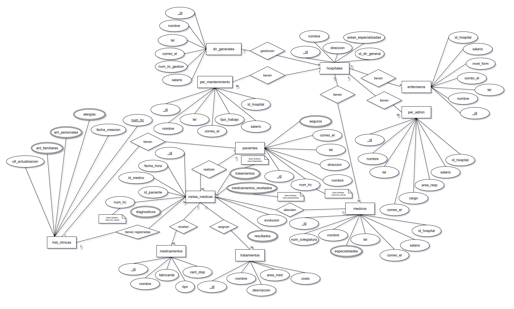

<h1 align=center>Base de Datos (DB) SISTEMA HOSPITALARIO</h1>

<h6 align=center>Proyecto MongoDB: (Dante Salamanca Galvis & Nicolás Chedraui Mantilla)</h6>

<br>

<h3 align=center>Introducción</h3>

A continuación se documenta minuciosamente el proceso que se siguió para ejecutar la elaboración de la base de datos solicitada para un sistema hospitalario enfocado en Bucaramanga y la zona metropolitana de Bucaramanga, implementando modelo conceptual, lógico y finalmente físico (otorgándole especial énfasis al proceso de normalización hasta la 3ra Forma Normal que se debe llevar a cabo entre estas últimas dos fases).

Se documenta cada parte del proceso, describiendo el flujo de trabajo lógico que se desarrolló, así como diagramas que muestran detalladamente los avances realizados en cada etapa del desarrollo de la BBDD, las entidades que derivaron de los requerimientos solicitados por el cliente y las relaciones entre estas (definiendo concretamente las cardinalidades que moldean estas relaciones: 1:1 / 1:N / N:M).

Finalmente, se realizan inserciones de datos dentro de nuestro sistema, se crean usuarios con diferentes permisos de acceso a la base de datos; ejecutando pruebas, como última medida, a través de consultas y funciones dentro de la BBDD que permitan a quienes tengan acceso a ella el poder manipular la forma en la que la información se presenta, pudiendo realizar diferentes tipos de filtrado de datos, entre otros tipos de consultas.

---

<h3 align=center>Caso de Estudio</h3>

El caso de estudio que dio origen a esta base de datos se centró, como se mencionó anteriormente, en el desarrollo de un modelo de datos para un sistema de aplicaciones de bases de datos para un sistema hospitalario o de salud alojado en la zona metropolitana de Bucaramanga, Colombia.

La tienda solicitaba una base de datos robusta que permitiera almacenar distintos tipos de información relacionada con las áreas que el sistema de salud deseaba cubrir. El cliente requería no sólo un sistema que almacenara datos sobre los pacientes, tratamientos, médicos, hospitales o administradores encargados de gestionar parte importante de cada hospital, sino también una estructura específica para el modelo de datos.

Por un lado, se necesitaba que los empleados de cada hospital estuvieran diferenciados en cinco tipos o roles: directores generales (bajo el cargo de estos se hallan uno o más hospitales por director; pero hay que tener en cuenta que cada hospital sólo podía ser asignado a un único dirigente), médicos, personal administrativo, personal de mantenimiento y enfermeros.

Algunas de las posibles entidades que surgieron a partir de los requerimientos ya poseían una estructura determinada por el cliente, o simplemente una base o esquema inicial sobre el cuál se podían empezar a realizar múltiples cambios a conveniencia del mantenimiento y mejor estructuración de la BBDD.

Hospitales, pacientes, historias clínicas, médicos, tratamientos, medicamentos y visitas médicas ya poseían unos atributos fijos definidos por el cliente, aunque estos en el futuro se pudieron llegar a normalizar, separándolos en colecciones diferenciadas. Además, hay que tener en cuenta que se consideró la posibilidad de crear nuevos atributos, diferentes a los ya especificados para generar un sistema más robusto.

Se especifican también relaciones entre directores generales y hospitales, así como relaciones entre pacientes y visitas médicas (un mismo paciente puede solicitar múltiples visitas, pero cada visita está asociada a un único paciente). Las demás relaciones se tendrán que deducir por lógica y siguiendo la estructura y contexto en el que se desarrolla la base de datos.

Dado que el sistema está enfocado en Bucaramanga y su zona metropolitana, los datos ingresados, la cantidad de estos y los formatos que se definirán a través de `$jsonSchema` serán coherentes con dicho contexto, estableciendo una conexión con la realidad que representa la BBDD.

---

<h3 align=center>Descripción del Proyecto</h3>

Este proyecto tiene como objetivo el diseño metodológico de un sistema de bases de datos orientado al ámbito de la salud. La propuesta contempla la estructuración de cada uno de los sectores necesarios para garantizar un almacenamiento de datos eficiente, coherente y seguro.

A través de este modelo, se busca facilitar, en el futuro, la gestión integral de la información médica, permitiendo una organización sistemática y consultas ágiles por parte del cliente. De este modo, el sistema está pensado para ofrecer una solución escalable y funcional frente a las crecientes necesidades de manejo de datos en instituciones del sector salud.

---

<h3 align=center>Requisitos del Sistema</h3>

Para poder ejecutar este proyecto, generando toda la base de datos creada con su estructura, esquemas, índices, datos (documentos) y permitir al usuario la realización de consultas y acceso a funciones **JavaScript** y roles, se precisará de las siguientes tecnologías:

- **MongoDB 8.0** / **cliente MongoDB Compass** (las dos son alternativas válidas, pero si se busca una interacción más visual con la BBDD, se recomienda la segunda opción).

- **Visual Studio Code** (*opcional:* facilita la apertura y lectura de los archivos alojados en este repositorio).

---

<h3 align=center>Planificación</h3>

<br>

<h4 align=center>Construcción del Modelo Conceptual</h4>

A partir de este caso de estudio, se inició por desarrollar lo que vendría siendo el primer modelo/prototipo de base de datos (en esencia, el modelo conceptual de esta). Este se basa en determinar, como primera medida, las entidades que harán parte de la BBDD, para posteriormente establecer atributos para cada una de estas y las relaciones entre entidad y entidad, especificando las cardinalidades de estas relaciones. 

Este modelo se elaboró de una forma muy rudimentaria, estableciendo las bases para futuros modelos (lógico / físico) de forma que se proporcionó una estructura sobre la cual se pudo trabajar en las siguientes tres fases del desarrollo de este modelo de datos para el sistema de aplicaciones de bases de datos.

<h4 align=center>Descripción</h4>

A grandes rasgos, lo que se determinó en esta primera fase fueron las entidades principales a trabajar (aquí no están plasmadas todas las entidades que se trabajaron, ya que tras el proceso de normalización se añadieron más de estas).

Estas entidades principales fueron `dir_generales`, `hospitales`, `enfermeros`, `per_mantenimiento`, `per_admin`, `hist_clinicas`, `pacientes`, `medicos`, `medicamentos`, `visitas_medicas` y `tratamientos`.

Los atributos que se definieron en esta primera etapa se establecieron a un nivel relativamente superficial, ya que no se tiene información detallada sobre cada entidad (solamente la estrictamente necesaria y solicitada por los requerimientos).

<h4 align=center>Gráfica</h4>



<h4 align=center>Descripción Técnica</h4>

Teniendo en cuenta el funcionamiento, más a profundidad, de la lógica detrás de este primer esbozo de la futura base de datos, podríamos desglosar más en detalle cada entidad y su relación con sus adyacentes.

Si nos centramos en el apartado de empleados, podemos observar como los diferentes roles especificados en los requerimientos se trabajaron como entidades separadas, asociadas todas a la entidad `hospital`, que tiene una referencia hacia su director general (dado que siempre es más recomentable que el N en una cardinalidad 1:N, sea el que posea la llave foránea). Cada tipo de empleado posee información muy similar en sus respectivas colecciones, aunque cada uno posee algo distintivo que lo hace resaltar y que genera la separación de una entidad a otra (en lugar de colocar todos los tipos como una entidad `personal` o `empleados`, con un atributo `rol`).

En un principio se establecieron relaciones que llevaban a dependecias transitivas redundantes, como por ejemplo, entre visitas médicas e historias clínicas (ya se hallan indirectamente conectados a través de la entidad intermedia `paciente`); pero estos errores se corregirían con el tiempo, gracias a la normalización. Además, no se consideró hasta esta etapa la posibilidad de incluir un inventario que realizara un conteo sistemático de los medicamentos en cada hospital, lo que más tarde generaría incongruencias que tendrían que ser mitigadas.

También cabe resaltar que en este punto y hasta la ejecución de la normalización hasta la segunda forma, habría una gran cantidad de relaciones muchos a muchos (cardinalidad N:M) que, si bien **MongoDB** lo permite, no facilita el buen y más eficaz manejo del sistema de bases de datos en el presente y a futuro. Entre estas relaciones hallamos la que se establece entre visitas médicas y diagnósticos o entre visitas médicas y tratamientos. Esto surge debido a que, por ejemplo, en el primer caso, una visita médica puede dar lugar a muchos diagnósticos; pero simultáneamente, un mismo diagnóstico puede ser asignado en múltiples citas con diferentes pacientes o médicos.

En resumen, este se trata de un modelo muy primitivo de la BBDD, que si bien facilita el bosquejo de una base o esqueleto para empezar a trabajar en la optimización de nuestro sistema, es muy poco eficiente y de implementarse, propiciaría un manejo de datos poco sostenible a lo largo del tiempo.

---

<h4 align=center>Construcción del Modelo Lógico</h4>

Una vez finalizado el modelo conceptual, se dio comienzo al proceso de establecimiento de un modelo lógico mejor estructurado en tablas (entidades) con columnas (atributos) y el tipo de dato para cada una de estas (string, int, decimal, etc.), así como determinadas características para determinadas columnas (primary key [PK] / foreign key [FK]).

<h4 align=center>Descripción</h4>

Si bien en esta etapa de la creación del sistema de datos aún no se tiene una claridad total de todas las entidades necesarias o de todas las relaciones posibles o desgloses que puedan surgir de atributos no lo suficientemente indivisibles o relacionados con las tablas a las cuales pertenecen; en este punto se pueden definir mejoras a ejecutar en el modelo que llegado a este momento se pueden identificar fácilmente.

Si bien antes ya se tenía una relación aproximada entre las colecciones, no se tenía una certeza completa de cómo se conectarían estas, unas con otras. Ahora se conoce, gracias a la asignación de tipos de datos (que se representarán en el modelo físico como un `bsonType`, dentro del `$jsonSchema`), que los ids que permitirán el `$lookup` entre tablas relacionadas serán enteros.

Básicamente, en este etapa no se realizan reestructuraciones de la base de datos, sino simplemente se transfiere el *Modelo Conceptual* a un esquema visual más limpio y específico con tipos de datos y llaves primarias y foráneas más explícitas.

<h4 align=center>Gráfica</h4>


<h4 align=center>Descripción Técnica</h4>

Una vez definido una base suficientemente sólida o alineada a los requerimientos solicitados por el usuario originalmente, se puede proceder a la siguiente fase: el *Modelo Conceptual*.

Aquí se definirán los tipos de datos de múltiples atributos, buscando siempre el formato que facilite más el correcto funcionamiento de la BBDD. 

Datos como el número de teléfono o el número de colegiatura (`medicos`) no se almacenarán como números, sino como cadenas de texto (debido a que no se realizarán operaciones con ellos y permite, como adicional, realizar operaciones con *regex*).

Por otra parte, se tiene en cuenta que si cierta información debe contener letras, como por ejemplo lo sería el número de licencia de gestión de los directores generales (su formato exige una combinación de letras y números), se tiene que guardar obligatoriamente como cadena de texto o `string`.

Los precios o datos monetarios (salarios, por ejemplo), se recomiendan almacenar como decimales, tomando como razón que (si bien en Colombia no suele aplicar), si la base de datos se amplía, podría requerir de precios con cifras decimales (aunque probablemente, también requerría de la agregación de un nuevo campo `moneda`, para indicar la unidad monetaria que se usa para medir dicho precio/salario).

Como último apunte antes de pasar al proceso de normalización del sistema que se lleva hasta el momento, se consideró en este punto del proceso la generación de una nueva entidad que almacenara las cantidades disponibles de cada medicamento por cada establecimiento clínico.

Así, tomando el siguiente requerimiento en mente:

```
- Cálculo de inventarios de medicamentos por hospital.
```

Se analizó que al poseer un simple atributo `cant_disponible` en cada medicamento, no sería posible realizar una búsqueda minuciosa de las medicinas disponibles, puesto que no se especificaría cuántas unidades restan de cada medicamento en cada hospital, sino cuántas restan en general (en todo el sistema hospitalario).

Así, se ejecutó la agregación de esta nueva actualización al modelo estructurado de datos, empleando esta nueva entidad como intermediaria entre las entidades `hospitales` y `medicamentos` (facilitando que exista un inventario por cada combinación posible de todos los hospitales con medicamentos existentes).

---

<h3 align=center>Normalización del Modelo Lógico</h3>

<br>

<h4 align=center>Primera Forma Normal (1FN)</h4>

En esta primera fase de la normalización del modelo lógico se solicita que todos los atributos existentes dentro de las tablas sean lo más indivisibles posible (en otras palabras, que sean valores atómicos). No se admiten atributos que puedan almacenar múltiples valores o datos que sean subdivisibles como múltiples números de teléfono, direcciones o nombres.

<h4 align=center>Descripción</h4>

La primera forma normal solicita que no existan datos con atributos divisibles dentro del sistema, por lo que se decidió ejecutar un desglose de las columnas direccion, nombre, junto con la creación de múltiples tablas que cumplen el rol de puente entre diferentes colecciones (generando relaciones con cardinalidad N:M entre estas dos entidades). 

Esta última decisión de estructuración se tomó para suprimir de múltiples entidades, como visitas médicas o historias clínicas, atributos con información relacionada, aunque no directamente, con estas; trasladándose estos a nuevas tablas generadas o a las entidades ya creadas que se hayan considerado verdaderas colecciones padres de estos, según sea el caso.

<h4 align=center>Gráfica</h4>


<h4 align=center>Descripción Técnica</h4>

Si bien se sabe que en **MongoDB**, está permitida la desnormalización, facilitando las búsquedas en atributos no atómicos o relacionados con cardinalidad muchos a muchos, esto no es lo más óptimo a largo plazo, ya que es más complicado adaptar la base de datos a nuevos contextos o en caso de agregar más información al sistema, resulta más complicado insertar datos si todo se encuentra embebido en arrays u objetos especificados como atributos.

Al mismo tiempo, una relación muchos a muchos puede complicar en exceso la adición de nuevos documentos a las colecciones, ya que los datos no tendrán un orden u organización que facilite la visualización y manipulación de la BBDD.

Por estas razones, se decidió implementar la subdivisión de diversos campos en otros más atómicos, o incluso, en casos extremos, en nuevas colecciones que (gracias a las cardinalidades N:M), generarán nuevas colecciones puente entre las entidades envueltas en el N:M.

Algunos ejemplos de estas modificaciones son los campos que indican la dirección de residencia de los pacientes o la dirección donde se hallan ubicados los hospitales (se decidió separar este atributo en cada una de las propiedades individuales que una dirección, en el contexto de Bucaramanga y su zona metropolitana, normalmente tiene), al igual que el nombre completo del personal y pacientes (particionando esta información en campos `primer_nombre`, `segundo_nombre` [opcional], `primer_apellido` y `segundo_apellido`).

Por otra parte, referente a la resolución de cardinalidades, los casos de atributos de tipo array que tuvieron que ser descompuestos en una o más entidades (dentro de nuestro modelo de datos) son:

**Campo especialidades en médicos:** un médico puede tener muchas especialidades y una misma especialidad se puede asignar a muchos médicos. Se separa en una entidad `especialidades`, conectada a médicos a través de la entidad puente `medicos_especialidades`.

**Campo antecedentes personales, antecedentes familiares y alergias en historias clínicas:** una historia clínica puede tener múltiples entradas de estos atributos y cada una de ellas se puede asignar a muchas historias clínicas (una misma alergia la pueden padecer muchos pacientes a la misma vez). Se separa en nuevas entidades `ant_personales` / `ant_familiares` / `alergias`, conectada a historias clínicas a través de las entidades puente `hist_clinicas_ant_personales` / `hist_clinicas_ant_familiares` / `hist_clinicas_alergias`.

**Campo diagnósticos, resultados, medicamentos y tratamientos en visitas médicas:** una visita médica puede generar múltiples diagnósticos y resultados o recetar y asignar múltiples medicamentos y tratamientos, respectivamente; y cada una de estos atributos se puede asignar a muchas visitas médicas (un mismo medicamento puede ser recetado a múltiples pacientes en diferentes citas). Se separa en nuevas entidades `diagnosticos` / `resultados` / `medicamentos` / `tratamientos`, conectada a historias clínicas a través de las entidades puente `visitas_medicas_diagnosticos` / `visitas_medicas_resultados` / `visitas_medicas_medicamentos` / `visitas_medicas_tratamientos`.

**Campo áreas especializadas en hospitales:** un hospital puede tener muchas áreas especializadas y una misma área se puede asignar a muchos hospitales. Se separa en una entidad `areas_especializadas`, conectada a hospitales a través de la entidad puente `hospitales_areas_especializadas`.

**Campo seguros en pacientes:** un paciente puede tener muchos seguros y un mismo seguro se puede asignar a muchos pacientes. Se separa en una entidad `seguros`, conectada a pacientes a través de la entidad puente `pacientes_seguros`.

---

<h4 align=center>Segunda Forma Normal (2FN)</h4>

La segunda forma normal solicita que no existan datos con atributos que no dependan de la clave primaria [pk] dentro del sistema. Esto, básicamente hace referencia a que datos que estén relacionados con la tabla a la que pertenecen, pero que esta relación no sea directa o sus columnas no sean inherentes de la entidad (pudiendo cambiar el elemento de la entidad al que pertenecen sin alterar estos atributos y mantener coherencia), deben ser trasladados a otra entidad independiente y ser referenciados a través de llaves foráneas en aquella tabla a la que previamente pertenecían.

<h4 align=center>Descripción</h4>

Teniendo en cuenta lo que la 2FN solicita, se pudo observar que el modelo ya existente tenía ciertas falencias en este ámbito, aunque pequeñas. Esto debido a que se pudieron identificar tres colecciones que poseían atributos fácilmente intercambiables con otros (lo que en esencia significa, que no son dependientes de la llave primaria de su respectiva colección).

Estos cuatro atributos (hallados en tres colecciones) eran el tipo y estado de los seguros médicos, las direcciones de los pacientes y los fabricantes de los medicamentos. Si bien, naturalmente, estas propiedades tienen cierta correlación con sus colecciones, esta relación no es intrínseca, ya que pueden considerarse estas como entidades separadas, facilitando la flexibilidad del sistema.

<h4 align=center>Gráfica</h4>


<h4 align=center>Descripción Técnica</h4>

Las mejoras implementadas en esta fase del proceso se centran más que todo en propiedades/atributos que, si bien se podrían dejar como se encuentran hasta este punto, es más conveniente separarlas en colecciones aparte de donde se encontraban alojadas en esta fase.

La primera razón que propicia este cambio es, como suele ser el caso cuando se habla de normalización, la flexibilidad y mantenimiento de la integridad de los datos a futuro (esto incluye poder ingresar nueva información al sistema con facilidad, o ampliar el alcance de este sin mayor complicación). Esto porque al poseer cada característica en una entidad aparte, se permite que se generen nuevos documentos en dichas entidades sin afectar lo que vendría siendo las inserciones que existan al momento de implementar un nuevo tipo de seguro, estado de seguro, fabricante o dirección de pacientes (como lo sería en nuestro contexto).

La segunda razón está orientada al almacenaje de información. Si mantenemos, por ejemplo, los fabricantes como un array de cadenas de texto, no se pueden introducir nuevas características de cada fabricante en caso de precisarlo (como nacionalidad o información de contacto). La única alternativa para esta solución sería embeber los datos de cada fabricante en un array identificado como `fabricantes`, pero esto generaría una posible alteración drástica del `$jsonSchema` establecido al momento y fomentaría la desorganización y desnormalización de la base de datos.

Por esta razón se decidió, dado que un seguro podría llegar a cambiar de tipo o estado si el paciente lo actualiza, o dado que los fabricantes de medicamentos podrían precisar de más información dentro de la BBDD (aislado del propio medicamento), o dado que un paciente podría cambiar rápidamente de una residencia a otra (modificando arbitrariamente los atributos de dirección y generando una relación no estrechamente directa con el `_id` del paciente); se decidió realizar el proceso de normalización en estas cuatro propiedades en colecciones separadas y referenciadas a sus entidades de origen.

---

<h4 align=center>Tercera Forma Normal (3FN)</h4>

La tercera forma normal establece que no deben existir dependencias transitivas dentro de la tabla. Esto significa que ningún atributo no clave debe depender de otro atributo no clave, es decir, los atributos que no forman parte de la clave primaria no deben estar relacionados entre sí de manera indirecta.

Si existe una dependencia transitiva, es necesario descomponer la tabla, creando una nueva entidad que contenga el atributo dependiente, de tal forma que se elimine la relación indirecta. Posteriormente, se establecerá una referencia mediante una llave foránea en la tabla original. Este proceso asegura que las dependencias entre atributos sean estrictamente directas a la clave primaria, garantizando mayor flexibilidad y consistencia en el modelo de datos.

<h4 align=center>Descripción</h4>

Para avanzar hacia la tercera forma normal, se analizó si el modelo actual presentaba dependencias transitivas que pudieran afectar la integridad de los datos. A partir de esta revisión, se identificaron algunos atributos que no dependían directamente de la clave primaria de sus respectivas tablas, lo cual motivó la reestructuración de ciertas entidades.

Se crearon nuevas tablas para separar adecuadamente información que antes estaba integrada de forma poco óptima, permitiendo así que cada atributo quede vinculado únicamente a la clave primaria de su entidad. Estas mejoras aseguran un modelo más limpio, estructurado y alineado con los principios de la 3FN.

<h4 align=center>Gráfica</h4>


<h4 align=center>Descripción Técnica</h4>

Sólo hubo dos cambios que se tuvieron que aplicar al modelo actual para cumplir exitosamente con las reglas establecidas en la tercera forma normal; relacionados con los atributos `barrio` y `municipio` de la colección `direcciones_pacientes` e `id_hist_clinica` de la colección `visitas_medicas`.

En el primer caso se identificó que el municipio y el barrio de una dirección tienen una relación indirecta o transitiva. Si bien ambos, tanto barrio como municipio, son partes fundamentales y directamente relacionadas con la propia dirección; tras un minucioso análisis se dedujo que el municipio es una propiedad que se relaciona con el `_id` de su colección no de manera directa sino a través de `barrio` (si conocemos el barrio, podemos extraer fácilmente el nombre del municipio al que pertenece).

Así, se creó una entidad denominada `barrios`, la cual posee una característica `municipio`. Cada barrio, de esta manera, tiene su municipio especificada en su propio documento, rompiendo la transitividad.

Por otra parte, un cambio pequeño que se implementó, derivado de la 3FN, fue la supresión de la relación a través del `id_hist_clinica` (id de historia clínica) que existía entre `visitas_medicas` e `hist_clinicas`.

Ahora, bien, es lógico que la relación entre estas dos colecciones es importante; pero lo que no se había captado hasta el momento, es que ya existía una relación indirecta entre estas dos colecciones (con la colección `pacientes` de por medio). Si se quiere acceder a una historia clínica desde una visita médica, simplemente se debe acceder primero al paciente asociado y este paciente tendrá asignada una historia clínica correspondiente a la historia clínica conectada con dicha cita.

---

<h4 align=center>Estructura de la Base de Datos</h4>

Se presenta un resumen rápido de las entidades/colecciones más importantes y cómo se relacionan entre ellas:

<br>

**alergias:** contiene información sobre algunas alergias que pueden estar presentes en pacientes, se almacenan en historias clínicas a través de la colección puente `hist_clinicas_alergias` que contiene referencias a ambas colecciones.

<br>

**ant_familiares/ant_personales:** contienen información sobre antecedentes médicos como cirugías, enfermedades o tratamientos previos (personales), o enfermedades hereditarias, constantes médicas en la familia o datos importantes de salud referentes al árbol genealógico de cierto paciente que lo pueda afectar indirectamente (familiares).

Se almacenan en historias clínicas a través de la colección puente `hist_clinicas_ant_familiares`/`hist_clinicas_ant_personales` que contienen referencias a ambas colecciones.

<br>

**areas_especializadas:** contienen información sobre las posibles áreas en las que determinado hospital puede estar enfocado. Se asocian con hospitales a través de la colección puente `hospitales_areas_especializadas` que contiene referencias a ambas colecciones.

<br>

**barrios:** barrios de las direcciones de pacientes y hospitales. Se conectan con `direcciones_pacientes` y `hospitales` de forma directa a través de una llave foránea en cada una de estas dos últimas colecciones.

<br>

**diagnosticos:** realizados durante o al final de visitas medicas, se almacenan en estas a través de la entidad puente `visitas_medicas_diagnosticos` que contiene referencias a ambas colecciones.

<br>

**dir_generales:** encargados de gestionar `hospitales` (pueden estar a cargo de más de un hospital, pero cada hospital sólo cuenta con uno), son referenciados con una llave foránea en el documento del/los hospital/es que están bajo su gestión.

<br>

**direcciones_pacientes:** contienen las direcciones de los `pacientes`, separadas en cada sección de las que normalmente se componen las direcciones en Bucaramanga y la zona metropolitana de Bucaramanga. Son referenciadas en el documento del paciente que reside en ellas como una llave foránea (relación 1:1).

<br>

**enfermeros:** se asocian con el hospital en el cual trabajan a través de una llave foránea en esta misma colección con el id de dicho establecimiento médico.

<br>

**especialidades:** contienen información sobre las posibles especialidades en las que determinado médico puede estar enfocado. Se asocian con médicos a través de la colección puente `medicos_especialidades` que contiene referencias a ambas colecciones.

<br>

**fabricantes:** fabricantes de `medicamentos`. Son referenciados en la colección `medicamentos` (relación 1:N con 1 en `fabricantes`).

<br>

**hist_clinicas:** cada paciente posee solamente una historia clínica y se conecta con ella a través de `id_hist_clinica`, campo de `pacientes` (contiene información sobre el número de historia, fecha de creación, ultima actualización y se asocia con `alergias`, `ant_familiares` y `ant_personales` en cardinalidad N:M).

<br>

**hospitales:** cada establecimiento médico de la base de datos está alojado en esta colección. Contiene referencias al director general que lo gestiona y es referenciado en todas las colecciones del personal (`enfermeros`, `medicos`, `per_admin` y `per_mantenimiento`).

<br>

**inventarios_medicamentos:** se relaciona con `hospitales` y `medicamentos` (contiene llaves foráneas a estas dos colecciones), conectando estas dos entidades en N:M, facilitando el conteo de la cantidad disponible de cada medicamento en cada hospital.

<br>

**medicamentos:** referencia a su fabricante y contiene información directa sobre su nombre y tipo. Son recetados en `visitas_medicas`, por lo que se almacenan en estas a través de la entidad puente `visitas_medicas_medicamentos` que contiene referencias a ambas colecciones.

<br>

**medicos:** *[INFORMACIÓN ÚNICA DEL MÉDICO: NÚMERO DE COLEGIATURA]* se asocian con el hospital en el cual trabajan a través de una llave foránea en esta misma colección con el id de dicho establecimiento médico.

<br>

**pacientes:** referencian a la dirección en la cual residen y la historia médica que les corresponde. Así mismo, son referenciados en `visitas_medicas` a través de una llave foránea en esta última colección.

<br>

**per_admin:** *[INFORMACIÓN ÚNICA DEL PERSONAL ADMINISTRATIVO: CARGO / ÁREA RESPONSABLE]* se asocian con el hospital en el cual trabajan a través de una llave foránea en esta misma colección con el id de dicho establecimiento médico.

<br>

**per_mentenimiento:** *[INFORMACIÓN ÚNICA DEL PERSONAL DE MANTENIMIENTO: TIPO DE TRABAJO]* se asocian con el hospital en el cual trabajan a través de una llave foránea en esta misma colección con el id de dicho establecimiento médico.

<br>

**resultados:** extraídos durante o al final de visitas medicas, se almacenan en estas a través de la entidad puente `visitas_medicas_resultados` que contiene referencias a ambas colecciones.

<br>

**seguros:** seguros médicos de los `pacientes`, se conectan con estos a través de una entidad puente `pacientes_seguros` (cardinalidad N:M) que contiene referencias a ambas colecciones. `seguros` referencia también a las colecciones `estados_seguros` y `tipos_seguros`, características de los seguros que fueron normalizadas en colecciones separadas.

<br>

**tratamientos:** contiene información directa sobre su nombre, descripción, área médica y costo. Son asignados en `visitas_medicas`, por lo que se almacenan en estas a través de la entidad puente `visitas_medicas_tratamientos` que contiene referencias a ambas colecciones.

<br>

**visitas_medicas:** contiene información sobre la fecha y hora a la que se realizó la consulta. Asimismo, referencia al id del paciente y médico que formaron parte de cada visita. Establece relación 1:N con `pacientes` y `medicos` (con N en `visitas_medicas`).

---

<h4 align=center>Construcción del Modelo Físico</h4>

Finalmente, tras completar la sección de normalización, se tomó el modelo lógico reestructurado por las tres formas normales y se llevó a cabo, a través de comandos por terminal **MongoShell**, la elaboración del modelo físico a partir del diagrama ya elaborado, especificando las colecciones, esquemas e índices únicos (datos que deben garantizar ser únicos de un documento a otro de su misma entidad).

<h4 align=center>Descripción</h4>

Una vez llegado a este punto, se empezaron a trasladar las 35 colecciones que componen el sistema desarrollado a comandos que **MongoDB** desde la **Shell**, pueda interpretar. Como ya se mencionó, se decidió usar el motor de bases de datos **MongoDB** y el aplicativo de administración de bases de datos **MongoDB Compass**.

<h4 align=center>Código</h4>

**[NOTA] :** El código que contiene los comandos que permiten la creación explícita de las colecciones, junto a sus esquemas e índices se halla como archivo en este mismo repositorio, bajo el nombre de `ddl.js`.

<h4 align=center>Descripción Técnica</h4>

Para empezar a implementar la base de datos `sistema_hospitalario` en un cluster, se debe seguir los siguientes pasos (suponiendo que ya se cuente con **MongoDB 8.0** o **MongoDB Compass** instalado en el sistema):

<br>

`1.` Desde la terminal de *Linux*, escribir el comando:

```
mongosh
```
 
Para acceder a la **MongoShell** de manera local o alternativamente usar:
 
```
mongosh '<uri>'
``` 
 
Para conectarse a una URI específica (si usa **MongoDB Compass**, conectarse directamente desde la interfaz del cliente).

<br>

`2.` Una vez dentro, se deberá ejecutar el comando (en **MongoDB Compass**, ejecutarlo en un entorno **Shell**):

```
use sistema_hospitalario
```

Para crear de manera implícita la base de datos donde se almacenará toda la información, estructuras, esquemas, funciones e índices.

<br>

`3.` Acceder al archivo `ddl.js` y ejecutar los bloques de comando indicados allí en orden (copiar y pegar bloque por bloque, del archivo a la **Shell**).

<br>

`4.` Cuando se halla realizado este procedimiento con todos los bloques de código alojados en `ddl.js`, se habrá "importado" la estructura base o Modelo Físico a su entorno o cluster.

<br>

#### Ejemplo (colección #1: `hospitales`):

```js
//esquema colección hospitales

db.createCollection("hospitales", {
    validator: {
        $jsonSchema: {
            bsonType: "object",
            required: ["nombre", "via_principal_tipo", "via_principal_numero", "via_principal_letra", "via_principal_bis", "via_generadora_numero", "via_generadora_letra", "via_generadora_bis", "placa", "id_barrio", "tel", "id_dir_general"],
            properties: {
                nombre: {
                    bsonType: "string",
                    minLength: 5,
                    maxLength: 100
                },
                via_principal_tipo: {
                    bsonType: "string",
                    enum: [
                        "Calle",
                        "Carrera",
                        "Avenida",
                        "Transversal",
                        "Diagonal",
                        "Circular",
                        "Autopista",
                        "Bulevar",
                        "Carretera",
                        "Troncal"
                    ]
                },
                via_principal_numero: {
                    bsonType: "string",
                    pattern: "^[0-9]{1,3}$"
                },
                via_principal_letra: {
                    bsonType: ["string", "null"],
                    pattern: "^[A-Z]{1,2}$"
                },
                via_principal_bis: {
                    bsonType: "bool"
                },
                via_generadora_numero: {
                    bsonType: "string",
                    pattern: "^[0-9]{1,3}$"
                },
                via_generadora_letra: {
                    bsonType: ["string", "null"],
                    pattern: "^[A-Z]{1,2}$"
                },
                via_generadora_bis: {
                    bsonType: "bool"
                },
                placa: {
                    bsonType: "string",
                    pattern: "^[0-9]{1,3}$"
                },
                id_barrio: {
                    bsonType: "int"
                },
                tel: {
                    bsonType: "string",
                    pattern: "^607[2-9][0-9]{6}$"
                },
                id_dir_general: {
                    bsonType: "int"
                }
            }
        }
    }
});
```

Este esquema, como se puede observar, cuenta con todas las características que se habían definido previamente (en el Modelo Lógico final, ya normalizado).

A través del comando `createCollection` se crea la colección `"hospitales"` de forma explícita; y con las funcionalidades implementadas de **MongoDB** `validator` y `$jsonSchema`, se especifica el tipo BSON que deberá tener la colección (objeto JSON), los campos que requiere obligatoriamente la entidad hospital:

```js
"nombre", "via_principal_tipo", "via_principal_numero", "via_principal_letra", "via_principal_bis", "via_generadora_numero", "via_generadora_letra", "via_generadora_bis", "placa", "id_barrio", "tel", "id_dir_general"
```

Así como las propiedades que deberá cumplir cada campo para que el documento que se inserte sea validado correctamente. **Por ejemplo:** el campo `nombre` precisa ser una cadena de texto de entre 5 y 100 carácteres; el campo `tel` precisa ser una cadena de texto compuesta por dígitos que sigan un patrón *regex* determinado (empezar por 607, seguido de 1 dígito entre 2 y 9, seguido de 6 dígitos entre 0 y 9); el campo `id_dir_general` precisa ser un entero cualquiera; etc.

Si se ejecuta este comando en la **MongoShell**, sea desde terminal de *Linux* o desde **MongoDB Compass**, se cargará la colección vacía `hospitales`, con el esquema indicando los campos requeridos y las condiciones que ha de cumplir cada uno.

Finalmente, se tiene este comando:

```js
db.hospitales.createIndex({ nombre: 1 }, { unique: true });
db.hospitales.createIndex({ via_principal_tipo: 1, via_principal_numero: 1, via_principal_letra: 1, via_principal_bis: 1, via_generadora_numero: 1, via_generadora_letra: 1, via_generadora_bis: 1, placa: 1, id_barrio: 1 }, { unique: true });
```

Que genera índices únicos en campos determinados, evitando que surjan datos repetidos en dichos campos en toda la colección. En este caso, se propicia que los nombres de los hospitales sean únicos, así como sus direcciones completas.

---

<h4 align=center>Inserciones de Datos</h4>

En esta fase del proceso, una vez creado el esqueleto de la base de datos, se pudo iniciar el proceso de inserción de documentos a cada colección. Este proceso consiste en, esencialmente, agregar a cada colección información relacionada con esta, que coincida con las validaciones implementadas con `$jsonSchema`, así como con la unicidad garantizada por los índices simples y compuestos generados en cada una de las entidades.

<h4 align=center>Descripción</h4>

En esta sección del proyecto **Sistema Hospitalario**, se aseguró que las inserciones fueran pertinentes, respecto a la estructura generada previamente. Así mismo, se asignaron ids coherentes con el contexto y que faciliten la realización de búsquedas por filtrado de diferentes atributos a través de *agregaciones avanzadas* (`aggregate`).

Teniendo en cuenta el contexto (base de datos de sistema hospitalario enfocado en Bucaramanga, Colombia y su zona metropolitana), se crearon datos que concordaran con dicho caso de estudio (números de teléfono, nombres, fabricantes de medicamentos, entre otros, acordes con el contexto).

<h4 align=center>Código</h4>

**[NOTA] :** El código que contiene los comandos que permiten la inserción de datos a las colecciones, se halla como archivo en este mismo repositorio, bajo el nombre de `dml.js`.

<h4 align=center>Descripción Técnica</h4>

Para implementar los datos correspondientes a cada colección en la base de datos `sistema_hospitalario` en un cluster, se debe seguir los siguientes pasos:

<br>

`1.` Desde la terminal de *Linux*, escribir el comando:

```
mongosh
```
 
Para acceder a la **MongoShell** de manera local o alternativamente usar:
 
```
mongosh '<uri>'
``` 
 
Para conectarse a una URI específica. El comando a usar dependerá de donde se hallan almacenado los esquemas creados previamente.

<br>

`2.` Una vez dentro, se deberá ejecutar el comando:

```
use sistema_hospitalario
```

Para acceder a la base de datos donde se encuentra la estructura del Modelo Físico que se generó con anterioridad.

<br>

`3.` Acceder al archivo `dml.js` y ejecutar los bloques de comando indicados allí en orden (copiar y pegar bloque por bloque, del archivo a la **Shell**).

<br>

`4.` Cuando se halla realizado este procedimiento con todos los bloques de código alojados en `dml.js`, se habrá "importado" toda la información (documentos) de la BBDD a su entorno o cluster.

<br>

#### Ejemplo (colección #1: `dir_generales`):

```js
//inserciones dir_generales

db.dir_generales.insertMany([
    {
        _id: 1,
        primer_nombre: 'Carlos',
        primer_apellido: 'Gómez',
        segundo_apellido: 'Rincón',
        tel: '3123456789',
        correo_el: 'carlos.gomez@gmail.com',
        num_lic_gestion: 'HOS-1234567',
        salario: NumberDecimal('12500000')
    },
    {
        _id: 2,
        primer_nombre: 'Diana',
        segundo_nombre: 'María',
        primer_apellido: 'Pérez',
        segundo_apellido: 'Suárez',
        tel: '3001234567',
        correo_el: 'diana.perez@hotmail.com',
        num_lic_gestion: 'HOS-7654321',
        salario: NumberDecimal('13000000')
    },
    {
        _id: 3,
        primer_nombre: 'Jorge',
        primer_apellido: 'Martínez',
        segundo_apellido: 'Ortiz',
        tel: '3012345678',
        correo_el: 'jorge.martinez@yahoo.com',
        num_lic_gestion: 'HOS-2345678',
        salario: NumberDecimal('11800000')
    }
]);
```

A través de este comando, se realizan las inserciones dentro de la colección `dir_generales`. Este, específicamente, "importa" tres documentos con información pertinente y solicitada por el esquema, de tres directores generales.

Cada campo tiene datos que coiciden con lo que se solicita a través del `$jsonSchema`, debido a que si la información insertada no coincide, podría surgir un error de fallo de validación.

---

<h4 align=center>Ejemplos de Consultas</h4>

En este apartado se podrán encontrar algunas de las consultas que se podrán realizar una vez importada toda la base de datos desde los archivos `ddl.js` y `dml.js`, y que se podrán encontrar en el archivo `dql_select.js`.

<br>

#### Consulta #8:

```js
//encontrar áreas especializadas que empiecen por la palabra "Medicina"

db.areas_especializadas.find({ nombre: /^Medicina/ });
```

Si se ejecuta esta consulta en un entorno de **MongoDB** donde ya se encuentre almacenada la base de datos `sistema_hospitalario` (sea desde terminal o desde **MongoDB Compass**), se obtendrá un resultado como este o similar:

```js
{
  _id: 24,
  nombre: 'Medicina Familiar'
}
```

Mediante un patrón *regex*, busca coincidencias donde una cadena de texto en el campo `nombre` de la colección `areas_especializadas`, empiece (`^`) con la palabra `Medicina`.

<br>

#### Consulta #10:

```js
//encontrar personal de mantenimiento que trabajen en el "Hospital Internacional de Colombia" y ganen más de $1.800.000

db.per_mantenimiento.aggregate([
    {
        $lookup: {
            from: "hospitales",
            localField: "id_hospital",
            foreignField: "_id",
            as: "hospital"
        }
    },
    {
        $unwind: "$hospital"
    },
    {
        $match: { 
            "hospital.nombre": "Hospital Internacional de Colombia", 
            salario: { $gt: NumberDecimal("1800000") } 
        }
    }
]);
```

Si se ejecuta esta consulta en un entorno de **MongoDB** donde ya se encuentre almacenada la base de datos `sistema_hospitalario` (sea desde terminal o desde **MongoDB Compass**), se obtendrá un resultado como este o similar:

```js
{
  _id: 5,
  primer_nombre: 'Teodoro',
  primer_apellido: 'Alvarez',
  segundo_apellido: 'Gonzalo',
  tel: '3362971411',
  correo_el: 'teodoro.alvarez864@gmail.com',
  tipo_trabajo: 'Pintura',
  salario: Decimal128('3350000'),
  id_hospital: 3,
  hospital: {
    _id: 3,
    nombre: 'Hospital Internacional de Colombia',
    via_principal_tipo: 'Autopista',
    via_principal_numero: '60',
    via_principal_letra: null,
    via_principal_bis: false,
    via_generadora_numero: '12',
    via_generadora_letra: 'D',
    via_generadora_bis: true,
    placa: '5',
    id_barrio: 20,
    tel: '6076789456',
    id_dir_general: 3
  }
}
```

A continuación, los pasos que genera esta consulta realiza para llegar al resultado final esperado:

`$lookup`: trae los datos de la colección `hospitales` a la colección actual (`per_mantenimiento`) y embebe toda la información en un nuevo campo `hospital` de tipo objeto.

`$unwind`: separa los datos embebidos en documentos separados para facilitar la próxima etapa.

`$match`: busca aquellos documentos, con el nuevo formato construido por las dos anteriores etapas, cuyo atributo `nombre` (embebido en el atributo creado `hospital`) coincida con el valor "Hospital Internacional de Colombia" y, simultáneamente, cuyo atributo `salario` sea superior (`$gt`) al número en formato decimal 1800000 (`NumberDecimal("1800000")`);

<br>

#### Consulta #47:

```js
//encontrar pacientes alérgicos a la caspa de animales

db.hist_clinicas_alergias.aggregate([
    {
        $lookup: {
            from: "hist_clinicas",
            localField: "id_hist_clinica",
            foreignField: "_id",
            as: "hist_clinica"
        }
    },
    {
        $lookup: {
            from: "alergias",
            localField: "id_alergia",
            foreignField: "_id",
            as: "alergia"
        }
    },
    {
        $unwind: "$hist_clinica"
    },
    {
        $unwind: "$alergia"
    },
    {
        $lookup: {
            from: "pacientes",
            localField: "hist_clinica._id",
            foreignField: "id_hist_clinica",
            as: "paciente"
        }
    },
    {
        $unwind: "$paciente"
    },
    {
        $match: { "alergia.nombre": "Alergia a la caspa de animales" }
    },
    {
        $project: {
            _id: 0,
            id_hist_clinica: "$paciente.id_hist_clinica",
            primer_nombre: "$paciente.primer_nombre",
            segundo_nombre: "$paciente.segundo_nombre",
            primer_apellido: "$paciente.primer_apellido",
            segundo_apellido: "$paciente.segundo_apellido",
            id_direccion: "$paciente.id_direccion",
            tel: "$paciente.tel",
            correo_el: "$paciente.correo_el"
        }
    }
]);
```

Si se ejecuta esta consulta en un entorno de **MongoDB** donde ya se encuentre almacenada la base de datos `sistema_hospitalario` (sea desde terminal o desde **MongoDB Compass**), se obtendrá un resultado como este o similar:

```js
{
  id_hist_clinica: 26,
  primer_nombre: 'Leandra',
  segundo_nombre: 'Candido',
  primer_apellido: 'Quero',
  segundo_apellido: 'Hoz',
  id_direccion: 51,
  tel: '3451104651',
  correo_el: 'leandra.quero.26@correo.com'
}
```

A continuación, los pasos que genera esta consulta realiza para llegar al resultado final esperado:

`$lookup`: trae los datos de la colección `hist_clinicas` a la colección actual (`hist_clinicas_alergias`) y embebe toda la información en un nuevo campo `hist_clinica` de tipo objeto.

`$lookup`: trae los datos de la colección `alergias` a la colección actual (`hist_clinicas_alergias`) y embebe toda la información en un nuevo campo `alergia` de tipo objeto.

`$unwind`: separa los datos embebidos (en `hist_clinica`) en documentos separados para facilitar la próxima etapa.

`$unwind`: separa los datos embebidos (en `alergia`) en documentos separados para facilitar la próxima etapa.

`$lookup`: trae los datos de la colección `pacientes` a la colección actual (`hist_clinicas_alergias`, desde el campo recién construido `hist_clinica`) y embebe toda la información en un nuevo campo `paciente` de tipo objeto.

`$unwind`: separa los datos embebidos (en `paciente`) en documentos separados para facilitar la próxima etapa.

`$match`: busca aquellos documentos, con el nuevo formato construido por las anteriores etapas, cuyo atributo `nombre` (embebido en el atributo creado `alergia`) coincida con el valor "Alergia a la caspa de animales".

`$project`: da formato al resultado para sólo mostrar los campos que sean de interés.

<br>

#### Consulta #55:

```js
//encontrar tratamientos que cuesten entre $5'000.000 y $6'000.000

db.tratamientos.find({ costo: { $gte: 5000000 }, costo: { $lte: 6000000 } });
```

Si se ejecuta esta consulta en un entorno de **MongoDB** donde ya se encuentre almacenada la base de datos `sistema_hospitalario` (sea desde terminal o desde **MongoDB Compass**), se obtendrá un resultado como este o similar:

```js
{
  _id: 2,
  nombre: 'Control de diabetes tipo 2',
  descripcion: 'Se desarrollan sesiones terapéuticas con duración variable según necesidad.',
  area_med: 'Medicina General',
  costo: Decimal128('3689201.04')
}
```

Mediante una condición, se evalúa si un valor decimal del campo `costo` de la colección `tratamientos`, es mayor o igual que (`$gte`) el número 5000000; y, al mismo tiempo, si es menor o igual a (`$lte`) al número 6000000.

<br>

#### Consulta #94:

```js
//mostrar sólo el _id y el costo de todos los tratamientos

db.tratamientos.find({}, { costo_tratamiento: { $concat: [{ $literal: "$" }, { $toString: "$costo" }] } });
```

Si se ejecuta esta consulta en un entorno de **MongoDB** donde ya se encuentre almacenada la base de datos `sistema_hospitalario` (sea desde terminal o desde **MongoDB Compass**), se obtendrá un resultado como este o similar:

```js
{
  _id: 1,
  costo_tratamiento: '$7112705.77'
}
```

Al no pasar ninguna condición al comando `find`, se mostrarán todos los documentos de la colección; pero se especifica cómo deben mostrarse. Al no especificar ningún campo, todos se ocultan, menos los que se indiquen. En este caso, se crea un nuevo campo denominado `costo_tratamiento` que consiste de una concatenación (`$concat`) entre los valores "$" (literal [`$literal`], debido a que este símbolo tiene una funcionalidad especial dentro de la sintaxis de **MongoDB**) y el valor del campo `costo` (presente en la estructura original), en formato `string` (`$toString`).